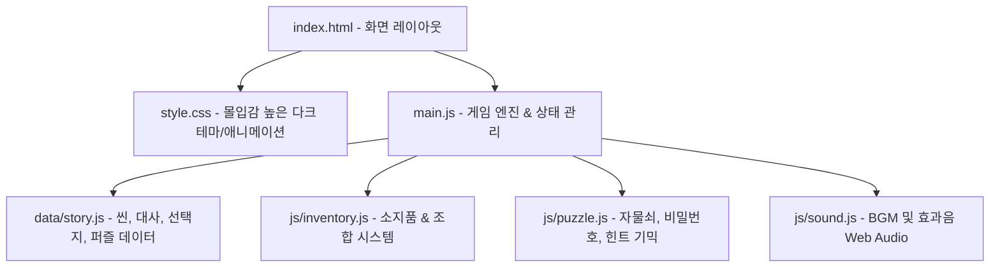
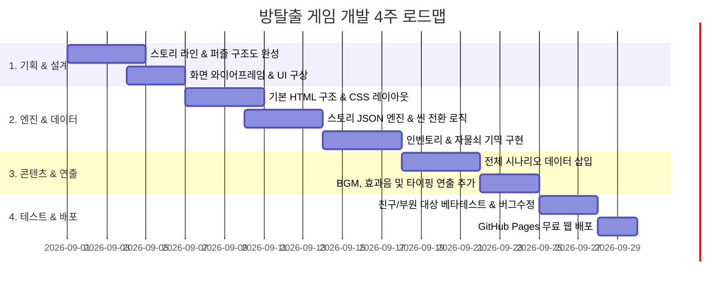

# [고등학교 동아리] 방탈출 / 텍스트 어드벤처 웹 게임 개발 계획서

고등학교 동아리 활동(축제 부스, 전시, 웹 개발 스터디 등)에서 학생들이 쉽고 재미있게 만들며 완성도 높은 결과물을 낼 수 있는 **HTML/CSS/JS 기반 방탈출 & 텍스트 어드벤처 웹 게임**의 전체 기획 및 개발 로드맵입니다.

---

## 1. 프로젝트 개요 & 추천 아키텍처

> [!NOTE]
> **순수 웹 기술(Vanilla HTML + Modern CSS + JavaScript) 권장 이유**
> - 별도의 서버나 복잡한 프레임워크(React 등) 빌드 과정 없이 `index.html`을 더블클릭하거나 GitHub Pages에 바로 배포 가능합니다.
> - **기획팀(스토리/퍼즐)** 과 **개발팀(UI/로직)** 이 역할을 나누기 쉽도록 **스토리 데이터(JSON/JS 객체)** 와 **게임 엔진(JS)** 을 분리합니다.

### 시스템 구성도

---

## 2. 게임 핵심 기능 및 기믹 설계

1. **대화 & 지문 출력 시스템 (Typing Effect)**
   - 텍스트가 한 글자씩 타자 치듯 나오는 몰입형 타이핑 효과 및 스킵 기능
   - 화자(NPC/독백) 표시 및 일러스트/배경 이미지 전환

2. **선택지 및 분기 시스템 (Branching Dialogue)**
   - 플레이어의 선택에 따라 이동하는 장소(Scene)와 스토리 전개 변경
   - 특정 아이템 소지 여부나 단서 발견 여부에 따라 잠금 해제되는 특수 선택지

3. **인벤토리 & 아이템 조합/사용 시스템**
   - 획득한 단서(메모, 열쇠, 도구 등)를 아이콘/리스트로 표시
   - 아이템 클릭 시 확대 조사(Inspector) 또는 2개 아이템 조합(Crafting)

4. **방탈출 전용 퍼즐 기믹**
   - **다이얼/키패드 자물쇠**: 4자리 숫자/문자 입력 모달
   - **단서 조합형 퍼즐**: 교실 칠판, 사물함, 스마트폰 화면 조사
   - **시간 제한 모드(Timer)**: 긴장감을 주는 카운트다운 타이머 (선택형)

5. **사운드 & 시각 효과 (SFX & Visual Effects)**
   - 방탈출 특유의 미스터리 앰비언스 BGM 및 클릭/문열림/자물쇠 효과음
   - 화면 흔들림(Shake), 플래시, 붉은 경고등 효과

---

## 3. 추천 시나리오 테마 후보

동아리 활동 및 학교 축제에 가장 어울리는 3가지 컨셉트입니다:

| 컨셉 번호 | 테마명 | 시놉시스 및 특징 |
| :--- | :--- | :--- |
| **Option A (추천)** | **야간 자율학습의 괴담 (학교 미스터리)** | 밤늦게 학교에 갇힌 주인공. 잠긴 교문과 교무실, 과학실을 탐색하며 숨겨진 비밀을 풀고 탈출. (학생 공감도 최고) |
| **Option B** | **사이버 수사관: AI의 연구실** | 통제 불능이 된 인공지능 연구소의 시스템을 해킹하고 서버실 비밀번호를 찾아내 탈출하는 SF 사이버펑크 스타일. |
| **Option C** | **타임 루프 1999 (레트로 미스터리)** | 1999년의 특정 교실에 갇혀 무한 반복되는 하루. 시간 왜곡의 원인을 찾아 2026년으로 귀환. |

---

## 4. 동아리 역할 분담 가이드 (팀 프로젝트 팁)

- **기획/스토리팀 (2~3명)**: 시나리오 작성, 퍼즐 트릭 설계, 단서 텍스트 작성 (`story.js` 데이터 시트 작성)
- **아트/사운드팀 (1~2명)**: 배경 이미지/단서 그래픽 생성(AI 툴 또는 직접 드로잉), 무료 SFX/BGM 수집
- **개발팀 (1~2명)**: HTML 마크업, CSS 스타일링/애니메이션, JS 게임 상태 및 로직 연동

---

## 5. 단계별 개발 로드맵

---

## User Review Required & Open Questions

> [!IMPORTANT]
> 프로젝트를 시작하기 전 아래 사항들에 대해 의견을 들려주시면 맞춤형 스타터 템플릿과 코드를 즉시 구성해 드릴 수 있습니다:
> 1. **원하시는 게임 테마**: 학교 괴담 / SF 연구소 / 판타지 던전 / 기타 구상하신 스토리
> 2. **비주얼 스타일**: 텍스트 중심(다크 UI + 선택지) vs 일러스트/사진 중심(포인트 앤 클릭형)
> 3. **우선 구현하고 싶은 핵심 기믹**: (예: 4자리 비밀번호 자물쇠, 아이템 합성, 타이머 제한 등)

---

## Proposed Changes (스타터 프로젝트 파일 구조)

동아리 활동을 바로 시작할 수 있도록 제공할 예정인 기본 파일 구조입니다:

### [NEW] `index.html` (메인 게임 화면)
- 게임 뷰포트 (배경, 캐릭터/오브젝트 레이어)
- 텍스트/대화 상자 & 선택지 컨테이너
- 상단 HUD (현재 위치, 타이머, 설정/사운드 토글)
- 우측/하단 인벤토리 바
- 팝업 모달 (자물쇠 입력기, 아이템 상세 뷰어)

### [NEW] `style.css` (디자인 시스템)
- 고해상도 글래스모피즘 & 다크모드 미스터리 테마
- 부드러운 전환 효과, 버튼 호버 이펙트, 흔들림 애니메이션
- 모바일/태블릿/PC 반응형 레이아웃 지원

### [NEW] `src/data/story.js` (시나리오 & 씬 데이터)
- 각 방/장소(Scene)별 설명, 선택지, 잠금 조건, 획득 아이템 명시

### [NEW] `src/js/game.js` (메인 게임 엔진)
- 게임 상태(gameState: 인벤토리, 현재 씬, 플래그) 관리
- 씬 전환, 아이템 획득, 퍼즐 해금 이벤트 처리

---

## Verification Plan

1. **브라우저 테스트**: Chrome, Edge, 모바일 브라우저에서 화면 깨짐 없이 반응형으로 잘 동작하는지 확인
2. **분기 및 세이브 테스트**: 다양한 선택지 이동 시 버그 없이 엔딩까지 도달 가능한지 검증 (LocalStorage 세이브/로드 포함)
3. **퍼즐 기믹 검증**: 올바른 정답 입력 시에만 자물쇠가 열리고 새 선택지가 열리는지 확인
